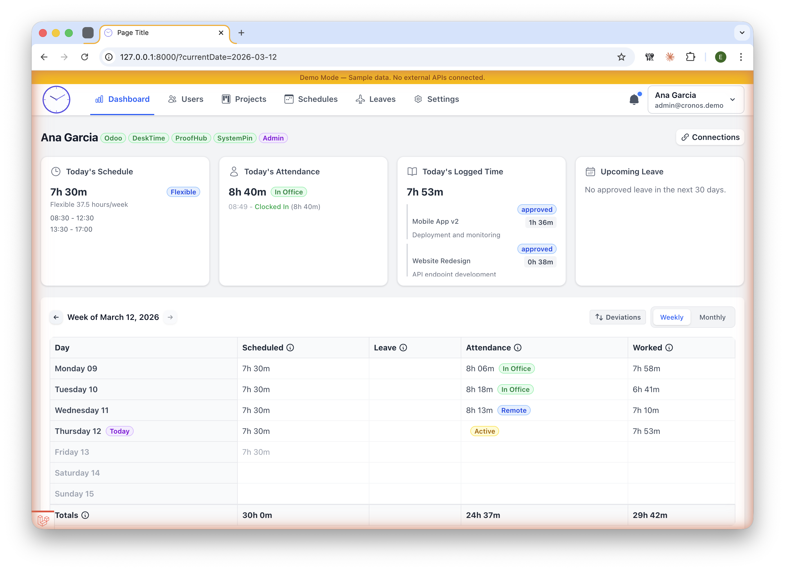

# Cronos

A workforce management application built with Laravel 12 and Livewire 3 that synchronizes data from Odoo, ProofHub, DeskTime, and SystemPin into a unified dashboard for employee time tracking, scheduling, attendance monitoring, and leave management.



## Demo Quick Start

Get Cronos running locally with realistic sample data in minutes -- no API keys required.

### Prerequisites

- PHP 8.2+, Composer, Node.js & npm
- Docker (for PostgreSQL) or a local PostgreSQL instance

### Steps

```bash
# 1. Clone and install
git clone https://github.com/your-username/cronos.git
cd cronos
composer install
npm install

# 2. Start the database
docker compose up -d

# 3. Configure environment
cp .env.example .env
php artisan key:generate
```

Update `.env` with database credentials (if using Docker, the defaults work):

```
DB_HOST=127.0.0.1
DB_PORT=5432
DB_DATABASE=cronos
DB_USERNAME=cronos
DB_PASSWORD=cronos
DEMO_MODE=true
```

```bash
# 4. Migrate and seed
php artisan migrate:fresh --seed

# 5. Build frontend assets
npm run build

# 6. Start the application
php artisan serve
```

### Demo Credentials

| Role | Email | Password |
|------|-------|----------|
| **Admin** | `admin@cronos.demo` | `password` |
| **Maintenance** | `maintenance@cronos.demo` | `password` |

## What to Explore

- **Dashboard** -- Today's schedule, attendance status (clocked in), and time entries for the logged-in user
- **Users** -- 18 employees across 4 departments with different roles, including archived and do-not-track users
- **Projects** -- 6 projects with ~25 tasks and assigned team members
- **Timesheet** -- Past 30 days of time entries per user across projects
- **Schedules** -- 3 schedule types (Standard 40h, Part-Time 20h, Flexible 37.5h) with detailed weekly breakdowns
- **Leave Types** -- 6 leave types (Annual, Sick, Personal, Unpaid, Parental, Compensatory)
- **Settings** -- Sync configuration, notification preferences, and data retention policies
- **Notifications** -- Sample notifications in the sidebar (mix of read and unread)

## Features

- **Multi-Platform Integration** -- Syncs employees, schedules, and leaves from Odoo; projects and time entries from ProofHub; remote attendance from DeskTime; office attendance from SystemPin
- **Unified Dashboard** -- Centralized view combining data from all platforms into a single interface
- **Real-time Sync** -- Configurable automatic synchronization with external platforms via background jobs
- **Attendance Management** -- Tracks both remote (DeskTime) and on-site (SystemPin) attendance with clock-in/out
- **Project & Task Management** -- Integrated project tracking with time entry logging from ProofHub
- **Leave Management** -- Full-day and half-day leave tracking with approval workflows from Odoo
- **Notification System** -- Configurable notifications (email, in-app, Slack) with per-user and global preferences
- **Role-Based Access** -- Admin, Maintenance, and User roles with appropriate permissions
- **Privacy Controls** -- Do-not-track mode that purges user data and excludes from sync operations

## Tech Stack

- **Backend**: Laravel 12, PHP 8.2+
- **Frontend**: Livewire 3, Alpine.js, TailwindCSS 4
- **Database**: PostgreSQL
- **Monitoring**: Laravel Pulse, Laravel Telescope
- **Search**: Laravel Scout (database driver)
- **Queue**: Database driver for background job processing

## Architecture Highlights

- **Actions Pattern** -- 24 action classes encapsulate business logic (sync operations, user management, data processing)
- **DTOs** -- Data Transfer Objects for clean data passing between layers
- **Multi-Platform Sync** -- 4 API clients with 17 sync jobs handle data synchronization
- **Observer-Driven Notifications** -- 11 model observers trigger 27 notification types automatically
- **External Identity Mapping** -- Users are linked to external platforms via a dedicated identity table, enabling cross-platform data correlation

## API Integrations

| Platform | Purpose | Data Synced |
|----------|---------|-------------|
| **Odoo** | HR Management | Employees, departments, schedules, leaves, categories |
| **ProofHub** | Project Management | Projects, tasks, time entries, team assignments |
| **DeskTime** | Remote Attendance | Remote work clock-in/out, productivity tracking |
| **SystemPin** | Office Attendance | Physical clocking machine data for on-site presence |

## Project Structure

```
app/
  Actions/         # 24 business logic action classes
  ApiClients/      # 4 external API client implementations
  DTOs/            # Data Transfer Objects
  Enums/           # Application enumerations
  Jobs/            # 17 sync jobs for background processing
  Livewire/        # 29 Livewire components
  Models/          # 22 Eloquent models
  Notifications/   # 27 notification classes
  Observers/       # 11 model observers
  Services/        # Shared services
```

## Development Setup

### Code Quality Tools

```bash
# Format code (Laravel Pint)
composer fix

# Static analysis (PHPStan)
composer analyse

# Run tests (Pest)
composer test
```

### Queue Worker

For background job processing (sync operations):

```bash
php artisan queue:work
```

## License

This project is licensed under the MIT License -- see the [LICENSE](LICENSE) file for details.
