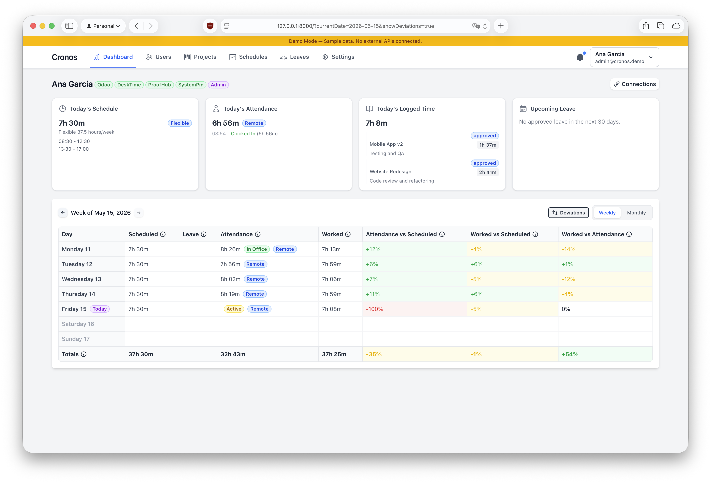
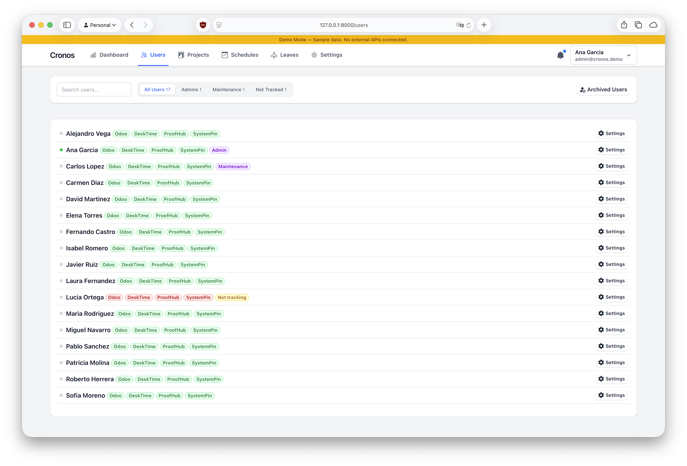
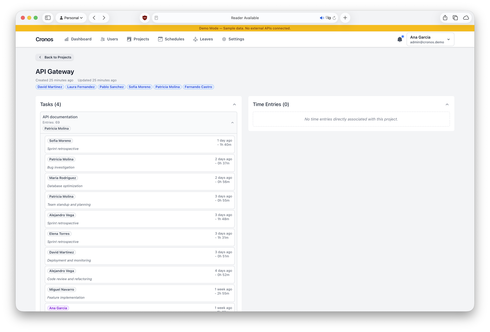
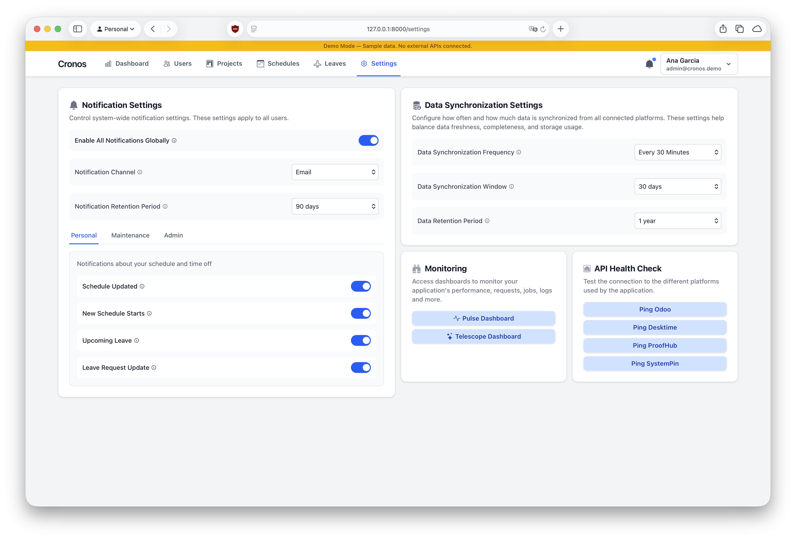
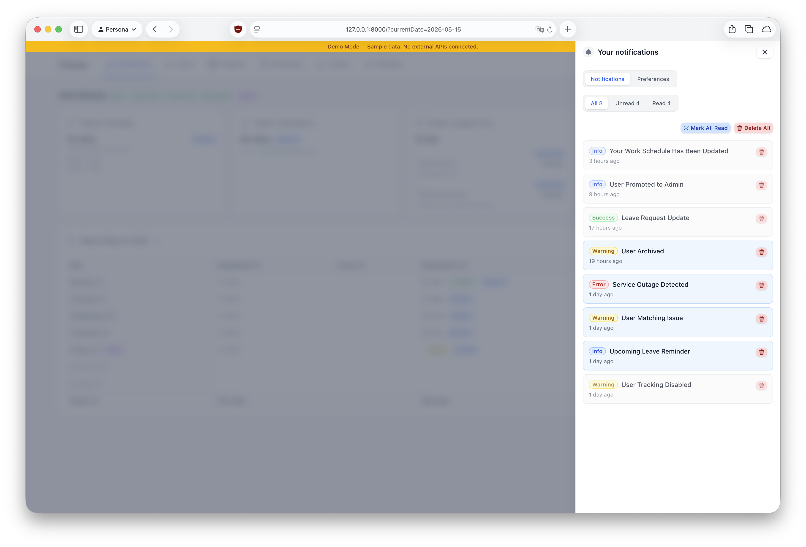

# Cronos

**One dashboard for workforce data scattered across four platforms.**

Cronos pulls employees and leaves from Odoo, projects and time entries from ProofHub, remote attendance from DeskTime, and on-site clock-ins from SystemPin — then resolves them into a single view of who worked, when, where, and on what.




The hero shot above is the dashboard's **deviations view** — a per-day comparison of scheduled vs attended vs worked time, with colored variance columns. It's how an admin spots a missed clock-in or an over-logged project.

## Demo Quick Start

Runs locally with realistic seeded data — no API keys or external services required.

### Prerequisites

- PHP 8.2+, Composer, Node.js & npm
- PostgreSQL 14+ running locally — e.g. [Postgres.app](https://postgresapp.com/) on macOS, `brew install postgresql@16`, or your distro's package manager

### Steps

```bash
# 1. Clone and install
git clone https://github.com/<your-user>/cronos.git
cd cronos
composer install
npm install

# 2. Create the database and role
createuser -s cronos
createdb -O cronos cronos

# 3. Configure environment
cp .env.example .env
php artisan key:generate
```

Update `.env`:

```dotenv
DB_HOST=127.0.0.1
DB_PORT=5432
DB_DATABASE=cronos
DB_USERNAME=cronos
DB_PASSWORD=
DEMO_MODE=true
```

`DEMO_MODE=true` paints a yellow "Demo Mode — Sample data, no external APIs connected" banner across every page. It's a visual reminder that no real Odoo/ProofHub/DeskTime/SystemPin credentials are wired up — the app runs entirely on seeded data. Set to `false` for production.

```bash
# 4. Migrate and seed (creates 18 users, 6 projects, 1400+ time entries)
php artisan migrate:fresh --seed

# 5. Build frontend assets and start the server
npm run build
php artisan serve
```

### Demo Credentials

| Role | Email | Password |
|------|-------|----------|
| **Admin** | `admin@cronos.demo` | `password` |
| **Maintenance** | `maintenance@cronos.demo` | `password` |

## Screenshot Tour

### Users — multi-platform identity at a glance
Every user shows the external platforms (Odoo, DeskTime, ProofHub, SystemPin) their data is synced from. Archived and do-not-track states are first-class.



### Project Detail — drill into tasks and time
Tasks list assignees and entry counts; expanding a task reveals its time log inline.



### Settings — sync, retention, monitoring, health
One screen covers notification preferences, sync frequency, retention windows, the Pulse and Telescope entry points, and per-platform API health checks.



### Notifications — severity-aware sidebar
25 configurable notification types funnel into a single tray, color-coded by severity, separable into Personal/Admin scopes, with read/unread tracking and per-user preferences.



## Features

- **Multi-platform sync** — 4 API clients feeding 15 background jobs, scheduled via Laravel's scheduler with configurable cadence and retention
- **Unified attendance** — Remote (DeskTime) and on-site (SystemPin) sources merged into a single per-user timeline
- **Project & task tracking** — ProofHub projects, tasks, and time entries with drill-down by task
- **Leave management** — Full-day and half-day workflows mirrored from Odoo
- **Deviation analytics** — Per-day comparison of scheduled, attended, and worked time with variance percentages
- **Configurable notifications** — Email, in-app, and Slack channels with per-user, per-type, and global preferences (Slack requires `SLACK_BOT_USER_OAUTH_TOKEN` + `SLACK_BOT_USER_DEFAULT_CHANNEL` in `.env`; each user can override the destination via `users.slack_channel_id`)
- **Role-based access** — Admin, Maintenance, and User roles
- **Privacy controls** — Do-not-track mode that purges user data and excludes them from sync operations

## Monitoring

Two first-party Laravel packages are wired in for production observability — both accessible from the Settings screen.

- **[Laravel Pulse](https://pulse.laravel.com/)** at `/pulse` — live performance dashboard. Tracks slow queries, slow jobs, slow outgoing HTTP requests, exception rates, and per-user request load. Storage: Postgres (no Redis dep). All Pulse recorders are enabled in `.env` so the demo populates immediately.
- **[Laravel Telescope](https://laravel.com/docs/telescope)** at `/telescope` — request-level debug inspector. Captures queries with bindings, dispatched jobs, mail, notifications, model events, exceptions, and Livewire updates. Useful when investigating why a specific sync ran the way it did.

## Architecture

- **Actions pattern** — 25 single-purpose action classes encapsulate business logic (sync orchestration, user lifecycle, data processing) — keeps controllers and Livewire components thin
- **DTOs** — Typed data carriers between API client and domain layers
- **External identity mapping** — A dedicated `user_external_identities` table links one Cronos user to N external-platform IDs, enabling cross-platform correlation without hardcoding mappings
- **Observer-driven notifications** — 11 Eloquent observers fan out into 25 configurable notification types, gated by `UserNotificationPreference` and `GlobalNotificationPreference`
- **Livewire 3 + Alpine.js** — Server-driven UI with minimal client JS

## API Integrations

| Platform | Purpose | Data Synced |
|---|---|---|
| **Odoo** | HR management | Employees, departments, schedules, leaves, categories |
| **ProofHub** | Project management | Projects, tasks, time entries, team assignments |
| **DeskTime** | Remote attendance | Remote clock-in/out, productivity tracking |
| **SystemPin** | Office attendance | Physical clocking machine data for on-site presence |

## Tech Stack

- **Backend** — Laravel 12, PHP 8.2+, PostgreSQL 14+
- **Frontend** — Livewire 3, Alpine.js, TailwindCSS 4
- **Search** — Laravel Scout (database driver)
- **Queue** — Database driver (no Redis required for the demo)
- **Monitoring** — Laravel Pulse + Laravel Telescope
- **Testing & QA** — Pest, PHPStan (Larastan), Pint

## Development

`composer test` expects a separate Postgres database for isolation. Create it once:

```bash
createdb -O cronos cronos_testing
```

Then the project scripts:

```bash
composer fix       # format (Pint)
composer analyse   # static analysis (PHPStan + Larastan)
composer test      # tests (Pest)
composer check     # lint + analyse

php artisan queue:work    # background jobs
composer dev              # serve + queue + log tail + vite, concurrently
```

## License

MIT — see [LICENSE](LICENSE).
